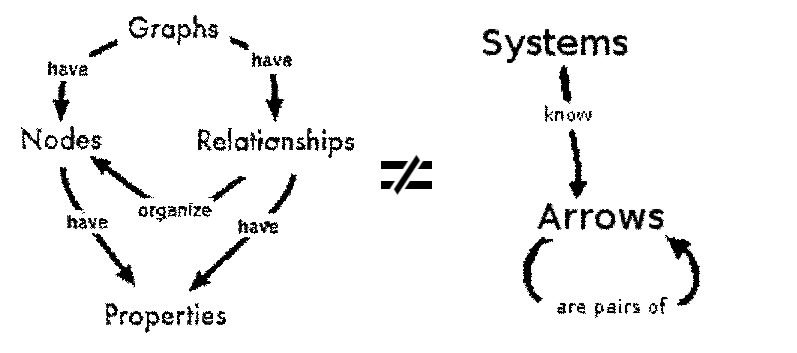
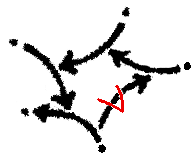
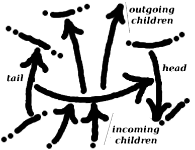
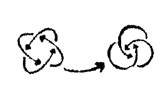
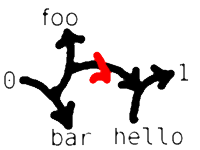
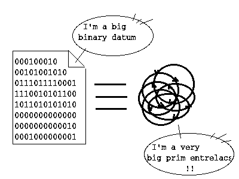

# The Entrelacs Paradigm

## Introduction

The way current computer systems manage information is shaped by the [Box/Value paradigm](BoxValueParadigm.md), which consists of representing information as graphs of boxed values.

The [Entrelacs Manifesto](EntrelacsManifesto.md) proposes to build a brand-new computing stack based on a radically different paradigm introduced hereafter: the _**Entrelacs Paradigm**_.

## At a glance

* No more than one building block to _tell_ everything: the **Arrow**.
* An arrow is an oriented pair of ... arrows. That's all.
* An arrow is considered in its "canonical" or "unique" form. Every definable arrow is mapped to at most one physical representation per system.
* An arrow is considered _immutable._ The physical representation of an arrow can't be modified once stored.
* An arrow is _connected_ with its ends. The system may browse these connections in both directions to explore all the information attached to every arrow.
* One doesn't need anything else but arrows to represent information. The _nodes vs. edges_ duality inherited from graph theory is removed.
* Raw data can still be considered as some sorts of arrows, typically re-entrant self-defining arrow constructs named _entrelacs_.

## An Arrow

An arrow ...

### is a Pair

An _arrow_ is basically a pair of arrows. **Arrow ends are not nodes but other arrows**. [Graph theory](http://en.wikipedia.org/wiki/Graph_theory)W doesn't cover arrow-made constructs.

### is Oriented

The pair (A, B) is distinct from (B, A).  

Note that one may dismiss this requirement and build back oriented pairs by combining non-oriented pairs.

### is Unique

> Unique, canonical, normed, hashed.  

An arrow-based system stores only one physical representation of the arrow (A, B) from A to B, when A and B are two known arrows.  

Self-referring sets of arrows - that is, _entrelacs_ as introduced hereafter - are also uniquely identified.

### is Immutable

An arrow is to be considered as a pure mathematical object. And in the same way that one can't "modify" a natural number like 2, one can't _modify_ an arrow within a system.  

The system dynamic goes by assimilating new arrows and forgetting old ones.

### is Connected

> Connected, Content-Indexed

Inside a given system, a certain arrow may be connected to many _children_ arrows, that is, arrows whose one of both ends are the considered arrow.  

The system must be able to efficiently browse all these children as it forms _emerging information_. It's the basis of a new kind of system ability.

## Wordlist

Each arrow is an oriented pair of arrows.

* The first arrow is the _tail_.
* The last arrow is the _head_.
* Tail and head are _ends_.
* An arrow _goes out_ its tail.
* An arrow _comes into_ its head.
* From its tail's point of view, an arrow is an _outgoing_ arrow.
* From its head's point of view, an arrow is an _incoming_ arrow.
* Incoming and outgoing arrows are _children_.
* Children, children of children, and so on, are _descendants_.
* Ends, ends of ends, and so on, are _ancestors_.

## _Entrelacs_

An _entrelacs_ is a set of intricated arrows forming a unique discrete connected construct. It means that any arrow from the set is the descendant/ancestor of all the other arrows of the set.

### Definition

A set of arrows E forms an entrelacs if and only if:

* Whatever 2 arrows A and B in E,
* A is a descendant of B.

One characterizes an entrelacs according to its topology, that is, how many arrows it contains and how these arrows are connected together. One considers that **entrelacs which are isomorphic are identical**.

| Examples: |  |  |
|-----------|---------------------------|---------------------------------------|
|           | [Orobouros](http://en.wikipedia.org/wiki/Orobouros)W, which has no ancestor but itself | Two entrelacs linked by a regular arrow |

### Entrelacs-Atoms Bijection (_mapping_)

Entrelacs act as atomic pieces of information.

* They have finished boundaries.
* One can't identify smaller isolated components in them.
* But one can **enumerate** them.
* There is no reason to discern its inner component. For example, Yin and Yang are not discernible from each other (what's true for one is true for the other). One may see such an entrelacs as a unique arrow.

To conclude, _entrelacs_ are assimilable in all respects to **atoms** like those found in [S-expression](http://en.wikipedia.org/wiki/S-expression)W.

## Practical considerations

### Assimilation process = Hashing

All system inputs (network events, user actions, ...) must be _assimilated_ into arrows before being processed by the system.

This "assimilation" process also occurs when low-level processes produce new data, e.g., numbers obtained by mathematical operations.

Arrows' uniqueness is enforced during assimilation by checking that no previous representation of each arrow exists in the storage space before adding one to it.

### Rooting

In cybernetic, a computer displays a behavior function that can modify itself through introspection (observation of its own state/behavior) and intercession (modification of its own mechanisms or state).

Within an [Entrelacs System](EntrelacsSystem.md), the whole knowledge might be defined as a single arrow _S_ that would typically represent the system's _behavior function_.

_S_ would be the only variable to change over time from an arrow to another. _S_ would be a super complex arrow based on all the arrows the system knows of at a given time.

But, for practicability, one will rather consider the system's knowledge at any time as a subset of all mathematically definable arrows, namely the _rooted arrows_.

A rooted arrow is an arrow which is considered "true" in the top-level context of the considered system.

On a [drawing](PenAndPaperReferenDesign.md), rooted arrows might be identified with a _root mark_.
  
_some rooted arrow._  
(check out the mark notation)

Arrow uniqueness induces that an arrow may often be simultaneously rooted and an ancestor of rooted arrows.

Thus, a system-level _garbage collector_ may periodically reclaim storage space by removing arrows which are neither a _rooted arrow_ nor some _ancestor_ of a rooted arrow.

### Handling of complex objects

From a theoretical perspective, _arrows_ are the only fundational building blocks needed to represent information.

However, a realistic system should handle raw data - like binary strings - as well.

Thanks to the [Entrelacs-Atoms One-To-One Correspondence](AtomEntrelacEquivalency.md), this doesn't deny the initial paradigm as _data_ eventually correspond to arrows.

More generally, an arrow-based system may be extended to take into consideration advanced building blocks like _tuples_ or _bags_ **as long as** these complex objects are handled exactly in the same way as their equivalent arrow constructs, especially in terms of uniqueness, immutability, and connectivity.

For instance, when assimilating the "hello world" character string, an arrow-based system must ensure that:

* There is no more than one copy of the string in the whole storage space.
* The string can't be modified in place.
* One may browse all the arrows connected to this string, like all the programs which cite "Hello world".

### Orthogonal persistence

A practical arrow-based system should ensure the [orthogonal persistence](http://en.wikipedia.org/wiki/Orthogonal_persistence)W of arrows. It means that neither programs nor users are concerned with information persistence. The management of RAM or disks, including caching, paging, and garbage collection, should be totally transparent.

### Knowledge representation with arrows

To build useful information structures with arrows, classical meta-models may be adapted, especially trees and lists. However, new meta-models may be explored. See ArrowModeling for further readings.

### Credits where it's due

#### Arrows as Hons

Arrows are similar to [cons cells](http://en.wikipedia.org/wiki/Cons)W, especially "hons" obtained by [hash consing](http://en.wikipedia.org/wiki/Hash_consing)W. A definition of "hons" is given by the documentation of [the ACL2 system](http://www.cs.utexas.edu/~moore/acl2/current/HONS.html).

All in all, the Entrelacs manifesto proposal simply consists of performing _hash consing_ at the operating system level, combined with _orthogonal persistence_ and systematic connectivity index building.

#### Arrows as equations

An Arrow might be seen as a set of equations, and an entrelac as an unreductible set of equations.

For example, the equation { _x = x.x_ } is "Orobouros" and the equations system { _x = y.y ; y = x.x ; x ≠ y_ } is "Yin-Yang".

Despite these equations having no meaning, they may still be used in bigger systems to define more complex arrows, like the compound arrow from "Orobouros" to "Yin-Yang". In other words, they may act as atoms to build up dictionaries and represent any form of knowledge.

#### A store of lambda Calculus expressions with no free variable

The Arrows paradigm may also be seen as the systematic hashing and storage of untyped "lambda calculus" terms exempt of free variables.

The paradigm doesn't define how computation takes place if any. But alpha-equivalence is used as an equivalence relation to identify recognizable lambda expressions - that is, entrelacs - and use them as constants to build more complex structures of knowledge.

* Orobouros : (λx.(x x))
* Yin-Yang : λx.λy.(λx.(y y) λy.(x x))
* (Orobouros → Yin-Yang) : (λz.(z z) λx.λy.(λx.(y y) λy.(x x)))

So classes of alpha-equivalent expressions without free terms are stored as building blocks to build up more complex expressions, and no atom is needed. It aims to make information fully homogeneous.

### Notation

A way to avoid the use of parentheses when writing atom-based arrows is to use prefix notation, so that `((a → ( b → c )) → d)` is written `→ → a → b c d`.

By using the slash character instead of → and the dot character as a separator between atoms, one gets a serialized string of a text-based arrow definition.

* `hello` is the UTF-8 1-byte binary string "hello"
* `/a.b` is `(a → b)` the arrow linking "a" to "b"
* `/c/a.b` is `(c → (a → b))` the arrow linking "c" to the arrow a→b
* `//a.b.c` is `((a → b) →  c)` the arrow linking the arrow a→b with "c"
* `/a/b.c` is `(a → (b →  c))` the arrow linking "a" to the arrow linking b→c
* `/a//b.c.d` is `(a → ((b → c) → d))`
* `//a/b.c.d` is `((a → (b → c)) → d)`
* etc.

The notation might be enhanced to tolerate missing and extra separators.

* uncomplete: An uncomplete slash expression (missing dot) falls back to the last parsed arrow so far.
* extra: Unexpected dot-separed atoms or additional slash expressions forms a right leaning tree structure with the last parsed arrow/atom.
* tail: Extra empty slashes replaces the last parsed arrow _a_ with the arrow from _a_ to Ouroboros (∞). If no arrow, it's Ouroboros itself.
* empty: the empty string is a valid atom which is not Ouroboros.

**Some equivalencies**

* '.' = '/.' = ('' → '') (extra)
* '..' = '//..' (extra)
* '/' = ∞ (tail)
* '//' = ∞ (tail)
* '/a' = 'a' (uncomplete)
* 'a/' = (a → ∞) (tail)
* '.a' = '/.a' (extra)
* 'a.' = '/a.' (extra)
* 'a.b' is '/a.b' (extra)
* 'a.b.c' is equivalent to '//a.b.c' (extra)
* 'a/b.c' is equivalent to '/a/b.c' (extra)
* '/a.b/c.d' is equivalent to '//a.b/c.d' (extra)
* 'a/b' is equivalent to '/a.b' (extra but uncomplete)
* 'a/b/c' is equivalent to '/a/b.c' (extra then uncomplete)

By itself, this textual representation is roughly compatible with _file pathes_.

* `/some/path/to/file.txt.gz` being reinterpreted as `(some → (path → (to → ((file → txt) → gz)))`

To distinguish a root path from a relative path, starts with /.

* '/a.b' is a relative path
* '/./a.b' id an absolute path
