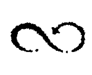

# Introduction #

The way current computer systems manage information is shaped by the [Box/Value paradigm](BoxValueParadigm.md) which consists in representing information as graphs of boxed data values.

The [Entrelacs Manifesto](http://code.google.com/p/entrelacs/) proposes to build up a brand new computing stack based upon a radically different paradigm introduced hereafter: the _**Arrow paradigm**_.

#### At a glance ####
  * no more than one building block to _tell_ everything: the **arrow**
  * an arrow is an oriented pair of ... arrows. That's all.
  * an arrow is considered in its "canonical" or "unique" form. Every definable arrow is mapped to at most one physical representation per system.
  * an arrow is considered "immutable". The physical representation of an arrow can't be modified once stored.
  * an arrow is "connected" with its ends. The system may browse these connections in both ways so to explore all the information attached to every arrow.
  * one doesn't need anything else than arrows to represent information. The old "nodes vs. edges" duality from graph theory is rejected.
  * But raw data can still be considered as some sorts of arrows, typically re-entrant self-defining arrow constructs named _entrelacs_.

## Arrow ##

<blockquote><h3>a pair</h3>
An <i>arrow</i> is basically a pair of arrows. <b>Arrow ends are not nodes but other arrows</b>. <a href='http://en.wikipedia.org/wiki/Graph_theory'>Graph theory</a>W doesn't cover arrow made constructs.</blockquote>

<blockquote><h3>oriented</h3></blockquote>

<blockquote>The pair (A,B) is distinct from (B,A).</blockquote>

<blockquote>Note that one may dismiss this requirement and build back oriented pairs by combining non-oriented pairs.</blockquote>

<blockquote><h3>unique</h3>
Syn. canonical, normed, hashed.</blockquote>

<blockquote>An arrow-based system stores only one physical representation of the arrow (A,B) from A to B, whatever A and B two known arrows.</blockquote>

<blockquote>Self-referring sets of arrows -that is <i>entrelacs</i> as introduced hereafter- are also uniquely identified.</blockquote>

<blockquote><h3>immutable</h3></blockquote>

<blockquote>An arrow is to be considered as a pure mathematical object. And in the same way that one can't "modify" a natural number like 2, one can't <i>modify</i> an arrow within a system</blockquote>

<blockquote>The system dynamic goes by assimilating new arrows and forgetting old ones.</blockquote>

<blockquote><h3>connected</h3></blockquote>

<blockquote>Inside a given system, a certain arrow may be connected to many <i>children</i> arrows, that is arrows whose one of both ends are the considered arrow.</blockquote>

<blockquote>The system must be able to efficiently browse all these children as it forms <i>emerging information</i>. It's the basis of a new kind of system abilities.</blockquote>

<h2>Wordlist</h2>

Each arrow is an oriented pair of arrows. 
<ul><li>The first arrow is the <i>tail</i>. 
</li><li>The last arrow is the <i>head</i>. 
</li><li>Tail and head are <i>ends</i>. 
</li><li>An arrow <i>goes out</i> its tail. 
</li><li>An arrow <i>comes into</i> its head. 
</li><li>From its tail point of view, an arrow is an <i>outgoing</i> arrow. 
</li><li>From its head point of view, an arrow is an <i>incoming</i> arrow. 
</li><li>Incoming and outgoing arrows are <i>children</i>. 
</li><li>Children, children of children, and so on, are <i>descendants</i>. 
</li><li>Ends, ends of ends, and so on, are <i>ancestors</i>.</li></ul>

<h2><i>Entrelacs</i></h2>

An <i>entrelacs</i> is a set of intricated arrows forming an unique discrete connected construct. It means that any arrow from the set is the descendant/ancestor of all the other arrows of the set. 
 
Definition: 
 
<blockquote>A set of arrows E forms an entrelacs if and only if 
<ul><li>whatever 2 arrows A and B in E, 
</li><li>A is a descendant of B</li></ul></blockquote>

One characterizes an entrelacs according to its topology, that is how many arrows it contains and how these arrows are connected together. One considers that <b>entrelacs which are isomorphic are identical</b>. 
 
 
 
<table><thead><th> Examples: </th><th>  </th><th>  </th></thead><tbody>
<tr><td>  </td><td> <a href='http://en.wikipedia.org/wiki/Orobouros'>Orobouros</a>W which has no ancestor but itself </td><td>
 2 entrelacs linked by a regular arrow
 </td></tr></tbody></table>

<h3>Entrelacs-Atoms Bijection (<i>mapping</i>)</h3>

Entrelacs act as atomic pieces of information. 
<ul><li>They got finished boundaries 
</li><li>One can't identify smaller isolated components in them. 
</li><li>But one can <b>enumerate</b> them 
</li><li>They are no reason to discern its inner component. For example, Yin and Yang are not discernible from each other (what's true for one is true for the other). One may see such an entrelacs as a unique arrow.</li></ul>

To conclude, <i>entrelacs</i> are assimiable in all respects to <b>atoms</b> like those found in <a href='http://en.wikipedia.org/wiki/S-expression'>S-expression</a>W. 
 
<h2>Practical considerations</h2>

<h3>Assimilation process <i>= Hashing</i></h3>

All system inputs (network events, user actions, ...) must be <i>assimilated</i> into arrows before being processed by the system. 
 
This "Assimilation" process also occurs when low-level processes produce new data, e.g. numbers obtained by mathematical operations. 
 
Arrows uniqueness is enforced during assimilation by checking that no previous representation of each arrow exists in the storage space before adding one to it. 
 
<h3>Rooting</h3>

From a theoretical perspective, the whole knowledge of a given system at given time might be defined as a single arrow <i>S</i>. <i>S</i> definition would include all other known arrows. It would be the only movable "variable" of the computer system. 
 
But, for practicability, one represents the system top-level knowledge as a mutable set of arrows, namely the <i>rooted arrows</i>. 
 
A rooted arrow is decorated with a "root" flag. It means that this arrow is considered "true" in the top-level context of the considered system. 
 

 <u>some rooted arrow.</u> (check mark notation)

Arrow uniqueness induces that an arrows may be often simultaneously rooted and an ancestor of rooted arrows. 
 
Thus, a system-level garbage collector must reclaim storage space by removing physical representations of arrows which are neither a <i>rooted</i> arrow nor an <i>ancestor</i> of any other rooted arrow. 
 
<h2>Handling of complex objects</h2>

From a theoretical perspective, <i>arrows</i> are the only building blocks needed to represent information. 
 
However, a realist system should handle raw data -like binary strings- as well. 
 
Thanks to the <a href='AtomEntrelacEquivalency.md'>Entrelacs-Atoms One-To-One Correspondence</a>, this doesn't deny the initial paradigm as <i>data</i> eventually correspond to arrows. 
 

More generally, an arrow based system may be extended to take into consideration advanced building blocks like <i>tuples</i> or <i>bags</i> <b>as long as</b> these complex objects are handled exactly in the same way as their equivalent arrow constructs, especially in terms of uniqueness, immutability, and connectivity. 
 
For instance, when assimilating the "hello world" character string, an arrow based system must ensure that: 
<ul><li>there is no more than one copy of the string in the whole storage space, 
</li><li>the string can't be modified in place, 
</li><li>one may browse all the arrows connected to this string, like all the programs which cite "Hello world".</li></ul>

<h2>Orthogonal persistence</h2>

A practical arrow-based system should ensure the <a href='http://en.wikipedia.org/wiki/Orthogonal_persistence'>orthogonal persistence</a>W of arrows. It means that neither programs nor users are concerned by information persistence. The management of RAM or disks including caching, pagingn and garbage collection should be totally transparent. 
 
<h2>Knowledge representation with arrows</h2>

To build useful information structures with arrows, classical meta-models may be adapted, especially trees and lists. However new meta-models may be explored. See ArrowModeling for further readings. 
 
<h2>Credits where it's due</h2>
<h3>Arrows as Hons</h3>
Arrows are similar to <a href='http://en.wikipedia.org/wiki/Cons'>cons cells</a>W, especially "hons" obtained by <a href='http://en.wikipedia.org/wiki/Hash_consing'>"hash consing"</a>W. A definition of "hons" is given by the documentation of  <a href='http://www.cs.utexas.edu/~moore/acl2/current/HONS.html'>the ACL2 system</a>. 
 
All in all, the Entrelacs manifesto proposal simply consists in performing <i>hash consing</i> at the operating system level, combined with <i>orthogonal persistence</i> and systematic connectivy indexes building. 
 
<h3>Arrows as equations in Abstract Algebra</h3>

Arrows definitions might been seen as systems of equations defined within a non-associative non-commutative non-unital but unipotent <i>magma</i>.  Alpha-equivalent classes of self-defined equation systems are called entrelacs and are used as atoms so to "bootstrap" a knowledge representation system.

For example, let's say the equation { <i>x = x.x</i> } defines "Orobouros" and the equations system { <i>x = y.y ; y = x.x</i> } defines "Yin-Yang". Despite these equation systems have no meaning yet,  they may still be used to define more complex arrows, like the compound arrow from "Orobouros" to "Yin-Yang". In other words, they may act as atoms so to build up dictionnaries and represent any form of knowledge.

<h3>A store of lambda Calculus expressions with no free variable</h3>

The Arrows paradigm may also been seen as the systematic hashing and storage of untyped "lambda calculus" terms excempt of free variables. The paradigm doesn't define how compution takes place if any. But alpha-equivalence is used as an equivalence relation so to identify recognizable lambda expressions -that is entrelacs- and use them as constants so to build more complex structures of knowledge. 
<ul>
 <li> Orobouros : (λx.(x x)) </li>
 <li> Yin-Yang : λx.λy.(λx.(y y) λy.(x x)) </li>
 <li> (Orobouros → Yin-Yang) : (λz.(z z) λx.λy.(λx.(y y) λy.(x x))) </li>
 </ul>
 
So classes of alpha-equivalent expressions without free terms are stored as building block to build up more complex expressions, and no actual dictionnary entry is needed. It aims to make information homogeneous and "scale-invariant" on a <i>meta-scale</i>.

<h2>Notation</h2>
A way to avoid the use of parentheses when writing atom-based arrows is to use prefix notation, so that ((a → ( b → c )) → d) is written "→ → a → b c d". Postfix notation produces "a b c → → d →".

Furthermore, by using the slash character as a prefix and the dot character as an atom seperator, one gets serialized strings which look likes <i>generalized pathes</i>.

 
 (a→(b→c))→d) becomes "//a/b.c.d" (prefix notation).

 "/some/path/to/file.extension" corresponds to (some→(path→(to→(file→extension))).
