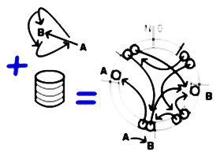

# Arrows Space

## introduction

An _"Arrows Space"_ (AS) refers to an abstract device to store arrows structures involved in the [Entrelacs Paradigm](ArrowParadigm.md). It's the key component of an [Entrelacs System](DesignIntroduction.md).

Please note one may simulate an Arrows Space with [paper and pencil](PenAndPaperReferenceDesign.md).

Maybe one day, an AS will be designed as a dedicated piece of hardware. If so, it won't necessarily consist in a bank of data buckets like all other data storage so far.

But for the moment, we introduce the AS as a piece of software leveraging on traditional volatile and mass memory hardware.

 <u>Artistic view</u> Arrows are basically stored as pairs of pointers

## AS requirements summary

One requires from an AS:

- **Orthogonal persistence**  
  > The AS must leverage on all persistent and volatile physical memory levels and flatten them down to a single homogeneous space.

- **De-duplication**  
  > The AS must ensure each mathematically definable arrow is never stored more than once in the whole storage space.

- **Full connectivity**  
  > The AS must store enough connectivity data to allow efficient retrieving of the ends and the _children_ of any arrow.

- **Garbage collection relatively to a _root_ referential**  
  - The AS must manage the _root_ boolean property of every stored arrow. The set of _rooted_ arrows forms a unique absolute referential.  
  - The AS must preserve rooted arrows and their ancestors from deletion, while arrows which are neither a rooted arrow nor an ancestor of a rooted arrow must be transparently removed from the storage.

- **Binary strings and other complex objects native support**  
  - The AS may allow raw data (binary strings) native storage.  
  - The AS may allow tuples (ordered set of arrows) native storage.  
  - Though such objects must be treated like their equivalent arrow-made constructs (entrelacs) in terms of uniqueness, immutability, and connectivity.

## API overview

The `ArrowSpaceInterface` sums up the _arrows space_ behavior to traditional software developers.

## How to reach these goals within existing hardware

### Prevent duplicates during arrows assimilation

The _Arrows Space_ is filled up by converting data into arrows. This conversion process is called _assimilation_. It takes place:

- when data—like user inputs—come from the outside.
- when some internal computation produces new arrows.

Each new arrow is assimilated from its farthest ancestors, that is _entrelacs_. One first assimilates entrelacs, then entrelacs' children arrows, then their grandchildren, and so on up to the overall assimilated arrow.

To ensure each mathematically definable arrow is stored at most once, the assimilation process may operate the whole mass storage device as a giant content-indexed open-addressed reentrant hash-table.

#### Main steps of an arrow _assimilation_

1. Hashing the arrow definition to get a default location.  
2. Looking for the existing singleton at the default location.  
3. Putting the arrow definition here if missing.  
4. Managing conflicts through _open addressing_ as introduced hereafter.

### "Hash everything!"

The first step of the arrow assimilation process consists in computing a default location where to probe the arrow singleton and store it if missing.

- **Concerning a regular arrow**, since it's basically a pair of ends, one computes its default location by hashing its both ends' addresses.  
- **Concerning raw data**, the AS should hash the whole object body.  
  - For a very long binary object, a **cryptographic hash function** is used to get both a default location and a unique signature:  
    - The signature is stored next to the object body to quickly identify a singleton.  
    - A cryptographic hash also avoids _data cluttering_.  
  - For a shorter binary object, a simpler **checksum** is used:  
    - This checksum doesn't uniquely identify the singleton. One must fully compare the candidate singleton to the assimilated object.

### Solve conflicts by Open Addressing

Once truncated modulo the total mass storage space size, a hash code defines a valid default arrow location.

In case of conflict with existing unrelated arrows, one shifts this default location by some offset. If there's still a storage conflict, one shifts the location again, and so on.

Looking for an already stored arrow consequently requires searching in several locations starting from a default one:

- If one finds the expected arrow at the considered address ==> hit!  
- If one finds an empty location ==> miss! This empty location is used to store the missing arrow.  
- If one finds something else, then one keeps on searching at a nearby location.

This approach is called [open addressing](OpenAddressing.md) when applied to hash tables. The default storage location is named an _open address_ and the search process described above is called _probing_.

### Perform Orthogonal Persistence

As a whole, the AS is a single persistent memory device merging all the memory levels of the hosting system. In other words, the AS stores arrows into a mass storage device accessed through a massive RAM-based cache. This cache operates almost all the available fast-access volatile memory resources.

## Anticipated prototype

All the strategies introduced above are applied to the currently designed [AS prototype](ArrowsSpacePrototype.md). See this page for more details.
