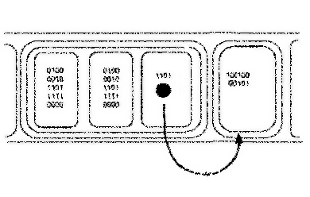
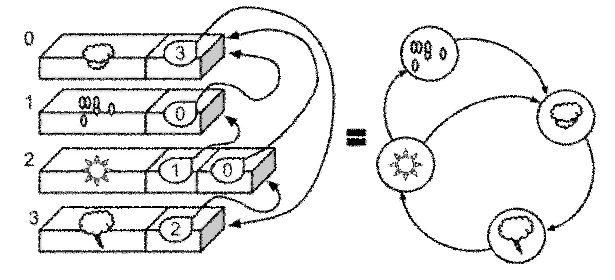

# The Box/Value Paradigm

## What's a Data Paradigm?

A large part of computer sciences consists in studying [Data Structures](http://en.wikipedia.org/wiki/Data_structure)^(W).

But how do we map _data structures_ onto a physical support in first place?

For example, let's consider a set of stats data organized as a [tree](http://en.wikipedia.org/wiki/Tree_(data_structure))^(W). How are we going to put such a tree onto computer volatile and persistent storage spaces, or even onto a single piece of paper?

Answering this question forms a _Data Paradigm_.
The answer consists in a _meta_ data structure.

## The only Data Paradigm ever used so far

So far, one stores an abstract data structure by dividing a storage space into boxes where to put values into. A value in a box is more than often a serie of smaller boxes, so that boxes are nested into each others. When a box content is not an additional subdivision of space, it may be an identifier used to locate another box somewhere else. These values are named _pointers_, _indices_, _keys_, ... and are often combined with each others to make bigger identifiers.

This approach forms the _Box/Value Paradigm_. It leverages a single _meta data structure_ to represent all forms of digitized information: graph vertices and edges, base tables and records, program objects and pointers, folders and files, etc.

The Box/Value paradigm transforms every piece of information into serialized nested boxes of binary objects. These lasting unstructured values -which are nothing else that natural numbers- are eventually what we users usually calls **data**.

## The Box/Value Paradigm is inherited from Writing

But why are we doing so? Why programmers don't question this way of reprenting information.

One may presume this is due to how _Speech_ and _Writing_ bind our thoughts.

_Writing_ is all about putting information into a hierarchy of nested boxes, like sentences containings words, up to elementary signs, like letters and ideograms.

As a concept is represented by a serie of textual components, storing many pieces of information about the same concept implies repeting the same serie many times.

Fortunately, we also use textual elements like pronouns to reduce redundancy by refering other concepts in a speech; They act like _pointers_ and _indices_ in computers. But all in all, _Writing_ is inherently a very redundant way to store information. It turns a single abstract concept like the number 42 into many physical representations.

_Writing_ is actually the reference design of the Box/Value Paradigm. This is why it is so deeply rooted in our mind.

## The Mathematical Model of the Box/Value Paradigm: the Graph Theory

> 

The Box/Value paradigm also shapes [Graph Theory](http://en.wikipedia.org/wiki/Glossary_of_graph_theory)^(W).

A _graph_ is composed of two types of elements, namely _vertices_ and _edges_. An edge can't be a vertex. A vertex can't be an edge. And so works the Box/Value Paradigm: Values and Boxes are actually two distinct concepts. A given value in a given box may point another box, like an edge pointing a vertex, but it can't point the concept of _a given value in a given box_, in the same way than an edge can't be the vertex of another edge.

When a technology like [triple stores](http://en.wikipedia.org/wiki/Triple_store) improves the default Box/Value representation process by replacing nested bounded boxes with editable and indexed graphes, it may fix a few flaws of the Box/Value Paradigm, but it doesn't change the underlying paradigm. So, most of the issues introduced herein can't be fixed by a graph-based information model, whatever its complexity.

To say it clearly: **as long as an information model relays on a _graph_ structure or its variants, it's still a manifestation of the _Box/Value_ paradigm.**

## Issues with the box/value paradigm

### Redundancy

> The box/value paradigm tends to project the same abtract concept to many representations located on many places. Basic relations between concepts are repeated in turn, and so are more complex structures, even if they all correspond to the same piece of information.
>
> For example, if our data tree contains several occurences to the natural number 2, this number will be repeated as it is in many boxes. Identical sub-trees made with the same set of natural numbers will likely be repeated as the tree grows despite  being a single mathematical entity.
>
> Our normative way of thing make us believe that such a redundancy is unavoidable. And yet it's actually not the case. Speech is time based and can't loop or cross-cut itself. But nothing forces us to copy several representations of the same concept onto a physical space. Duplicating representations of atomic or composite abstract concepts is a design flaw which complexifies information leveraging.
>
> The issue is not so about room sparing. It's all about all the additional useless work one has to do to manage all these potential representations of the same concept to be able to reason about it. Deduping information is the burden of all advanced computer programs, and it's always a very complex and very resource-costly piece of software.
>
> **Impact** You can't ask for your computer when and how it makes use of a given PI number approximation, or some English word it knows. Local Search engines are a very partial solution to this problem.

### Useless Compartmentalization

> A regular operating system allows the end user to browse the first levels of the structure of nested boxes, like files and folders, network connections, and running applications and processes. However, the overal sytem is blind to the inner structure of smaller boxes, which depend on the application which manages them.
>
> Thus, neither a human user nor a software agent can fully browse and operate the whole information in a given computer. A given program can only _cross-cut_ pieces of information stored into the boxes it is aware of.
>
> And so, the Box/Value paradigm eriges arbitrary frontiers within the information space, preventing the creation of new information and useful behaviors
>
> **Impact** A media manager will have access to user files in a couple of well-known folders but will be blind to media existing in other applications, like those attachments managed by messaging agents. No software can even access to the pictures currently displayed by running applications. Screenshoting is a very partial solution to this problem.

### Useless Duality

> The box/value paradigm is based upon a fundamental duality of information. There are _Boxes_ on one side, and _values_ on the other side.
>
> This duality contaminates every aspect of the computer world. It shapes the relationship between computers and their users. It eventualy curbs the usefulness of computers.
>
> **Impact**: application developpers on one side, end-users on the other side. Maybe fine for the industry; but is it always fine to you?

### Rigidity

> As values and boxes are most of the time gathered into larger boxes, the box/value way has a negative impact on information plasticity.
>
> Bringing changes to information continuously obliges to enlarge existing boxes, and shift data to get room. It leads programs to be excessively complex due to costly [serialization and deserialization](http://en.wikipedia.org/wiki/Serialization)W processes which aim to get back a bit of this lost plasticity.
>
> Despite these huge and costly efforts in software development, most information that resides in a computer -the programs themselves in first place- can't be modified by "John Doe" user to better fit his needs.
>
> **Impact**: you can't modify your preferred application in any other aspect than those anticipated by its developers. **Open Source** doesn't help much, even with good coding skills.

### Opacity

> With the box/value paradigm, one gives meaning to data by considering the boxes they belong to. For a given value at a given location, one must take into consideration its location relatively to its parent box, which is itself positioned in its grandparent box, and so on up to the underlying material.
>
> As said before, boxes boundaries are generally indistinguishable from the outside. So in most cases, one can't even characterize the upper box containing a given value at a random place. This opacity prevents to recover the hierarchy of contexts needed to find the meaning to a found value.
>
> **Impact** Software can't be studied and modified without original source code. Also, data buried in user files can't be browsed without the specially created programs which manages these data. Extracting information from _raw_ data out of any context is called data _forensics_ and is more considered as a kind of hacking.

### Broken information retrieval

> A box/value based information storage only guarantees that information may be browsed in one direction: from the highest boxes to the lowest values. It can't be simply browsed in the opposite direction. A program typically can't fetch the references up to a known box.
>
> **Impact** In most file systems, there is no simple way to know which directories links to a given file. But What's worse is how most file references in programs consist in regular strings -file paths- that are lost in code and data with no way to efficiently retrieve and change them.

### No Meta Linking

> With the box/value paradigm, a box content is either a reference to a box -though there is generally no way to know it- or not. So one easily represents either the concept of "such a value" or "such a box".
>
> But this way to store information  can't simply represent a concept like _"such a value in such a box"_, or _"such a box in such a box"_ while such concepts are valid and useful pieces of information that humans can easily understand and handle.
>
> That's why existing computer based systems are unable to handle its own knowledge at an higher _level of abstraction_, i.e. at a _meta level_. It might be the biggest issue of the box/value paradigm.
>
> Sure, many popular applications claim they manage _meta-data_ about various things. But keep in mind that these applications only consider **one** level of "meta". They are notably incapable of managing meta-data attached to these meta-data.
>
> **Impact** Regular systems don't provide simple ways to store meta-data about meta-data, like the time when access policies changed for a given file.

## Weak and Fragile

> Most box/value based storages doesn't provide simple generalized ways to link existing boxes with each others.
>
> Sure one may create a box including a reference to another box, but this reference will be broken or outdated if the box moves within the storage space or if its content evolves. In such conditions, no software can ensure satisfying system level consistency.
>
> **Impact** Media Managers attach information to media by indexing their database by file pathes. These tenuous links are easily broken by renaming or moving original files. In regular systems, program can't obtain strong and reliable references to existing files so to attach information on them from the outside. Once files are moved, renamed, deleted or modified in place, these bindings got wrong.

## Absolutism

> Within a box/value storage space, some boxes may store other boxes references as values. This architectural pattern leads to hierarchies of contexts embedded into each others -like folder trees-. In other words, it leads to store graphs of graphs, that is _meta-graphs_.
>
> This is the usual way to implement user profiles, accounts, workspaces, and such. That's also the typical solution to store _meta-data_ referring existing contents.
>
> But in the same way than graph theory doesn't allow edges ends to be other edges, the box/value framework provides no way to represent a concept like "such a value in such a box".
>
> So while data may be defined relatively to some context, the meaning of such a data considering such a context can't be stated and devised relatively to a higher level of abstraction.
>
> At the very end, the computer behavior turns out to be mostly _hardcoded_ because there is no way to store different interpretations of existing pieces of informations.

ArticleCompleteness: 70%
