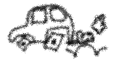
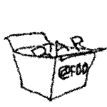
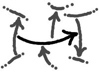
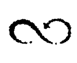

# An other introduction to the Entrelacs Project

## The _square wheel_ of NTI

Software engineering sometimes looks like mechanic without the invention of wheel.

The _square wheel_ of software is the [Box/Value Paradigm](BoxValueParadigm), a fundamental way of storing data on digital supports, derivated from this marvelous invention called "writing".

All technologies so far use the same method to store information. They put data to some locations on some physical support, and use part of these data as identifiers to link these locations together: file systems, data bases, programming languages, data structures, office documents, ... even modern structured data files like XML or RDF, they all follow the same approach.

This approach unfortunately dispatches the same piece of information in a myriad of duplicates, and it is also unable to properly represent meta-information. One knows how to put a value in a box, but the relation "this value within that box" can't be stored neither as a box nor as a value.

These limitations prevent computers to abstract and reason on their acquired knowledge beyhond surface level. They makes computers dumber than they should.

The [Entrelacs Manifesto](EntrelacsManifesto.md) proposes to create an information system which gets ride of the _Box/Value Paradigm_ by leveraging on a new kind of information building blocks: _arrows_.

## Arrows are Arrows

An arrow is... a pair of arrows. That's it.

Coders may consider an arrow as

- a structure of 2 pointers linking instances together (C)
- a _con_ of cons (Lisp)
- a record in a twice reentrant relation table (SQL)
- an URI returning a pair of URI (web)
- ...

This fully recursive definition is self-sufficient and is _homoiconic_. It means that, it doesn't depend on several kinds of components like _vertices and edges_ in Graph Theory.

### "Look ma, no vertice"

No vertice? Like, a formal grammar without terminal symbols? How possible?

Well, just build your knowledge on top of _Entrelacs_.

For example, consider the arrow whose tail and head both point back to itself, like an 8 number or the infinity symbol. It's "Ouroboros", the simplest entrelacs. You could use it to represent the 0 number.

An _Entrelacs_ is an intricate ball of arrows linked to each others so to have these remarkable properties:

- being self-defined with closed boundaries,
- without being a pair of smaller structures,
- being recognizable by its topology, i.e. the number of distinct arrows and how they are linked to each others, like we just did with "Ouroboros".

Entrelacs may be numbered, that is mapped with natural numbers.

So every piece of raw data is equivalent to a mathematicaly defined Entrelacs, and other arrows are mathematical constructs made of linked Entrelacs.

## Why this paradigm change matters?

### Abstract concepts made concrete

We know that there is not a "grand ma" unique neuron per concept in the human brain. However, the brain really makes it so it looks like this.

When a human thinks about a concept like the pi number, he can reflex about everything related to it. A person may easily tell the last time he used the pi number and how he used it. She could tell what concepts are related to pi, and so on. By digging in his memory, she could retrieve even more personal information, like the teacher who introduced her to the pi number.

Meanwhile, a regular information system stores plenty of "pi" copies -either as its approximative value or as its textual symbol- but it can't make any reasoning about these copies:

- "Hey computer! Tell me where you make use of the pi number and which approximation you use?"
- "I can't do that"
- "I want you to use more decimals, whatever the program you run."
- "I can't do that"

Meanwhile, an Entrelacs System forbids duplicates of concept representations.
It ensures that each mathematically definable arrow is mapped at most once in a unique physical copy in the whole storage space.

It's not enough to make a computer "understands" a pure concept, but it's a starting point. For example, such a system may identify the "hello" to "world" arrow and retrieve connected information every time it handles this pattern.

### Meta-contextualization

So arrows may represent any form of abstract knowledge.

But the meaning of a sign depends on the observer, and a piece of knowledge is always defined relatively to a context.

In a regular information system, there is no way to express such meta-relationships. At best, a system may store a few levels of meta-data: files have names, values have types, ... but everything else is out of the system scope.

In an _Entrelacs System_, meta-relations may be defined on as much levels as necessary. It simply takes the form of additional arrows linking already existing arrows.

Now you may notice that if one edits an arrow, one risks to propagate the change to all these super-structures.

That's why one doesn't change an arrow once it's stored. Arrows are _immutable_.

Arrow structures are consequently _persistent_. It means one can't alter such a structure. One may create a new structure instead, by reusing part of the existing one.

## the Arrow Space: an unique, giant, reentrant hash table

Ensuring each arrow is stored only once is done when assimilating external data. The whole persistent memory is turned into a giant content-indexed open-addressed hash table with back-references in the same table.

The so-called [Arrow Space](ArrowsSpace.md) features _orthogonal persistence_. It means the storage merges peristent and volatile memories (disks and RAM) for both developers and end users: every agent (application) is running, every file is open and continuously saved, every piece of information is saved on the fly. And at the end, a very simple counter-based _garbage collector_ retrieves the space taken by forgotten arrows.

## A programing Language to leverage on arrows

The [Entrelacs Paragigm](ArrowParadigm.md) is an attempt at defining a theory of knowledge representation. It is not a computation model like Lambda Calculus, Combinatory logic, Pattern Matching Languages, and such.

However, the Entrelacs meta-model is the ideal companion of a purely functional language. An _Entrelacs System_ is to the Entrelacs Paradigm what Lisp is to Lambda Calculus, a technology adhering as much as possible to its fundation theory.

That being said, all programming languages may be adapted to arrow constructs instead of text. An arrow-based language might be imperative or declarative, functional or object-oriented, etc.

Also, Arrows allow to easily embed evaluation contexts in each others. So many virtual machines may coexist in the system, corresponding to many languages and environments embedded into each others. End User Applications themselves might be designed as abstract machines processing user inputs as defined by a Domain Specific Language.

The root execution environement on top of this hierachy may look like Lisp, but adapted to arrows.
The [Entrelacs System](EntrelacsSystem.md) aims to include a language combining both a purely functional model and a purely Entrelacs model. Such a language should manifest outstanding abilites. To name a few:

- machine-level persistent reflexivity: the whole machine state might be acceded by programs as a first order object. It would include closures, continuations chains, environments, etc. Also programs may make persistent changes to themselves.
- transparent "memoization": A system-level computation cache avoids repeating twice the same computation without additional programing.
- Source code, CST, AST: Arrows based constructs replace them all.
- True orthogonal persistency
- and so many more...

## conclusion

Join us at <https://github.com/miellaby/entrelacs>
