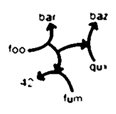

# Project

**The Entrelacs project** consists in prototyping an *Entrelacs System* as defined by the [Entrelacs Manifesto](EntrelacsManifesto.md).

## Project Repository

<https://github.com/miellaby/entrelacs>

## Demo

When the alpha server is up, you may try its [web terminal](web-terminal/index.html#pub).

## FAQ

[FAQ](FAQ.md)