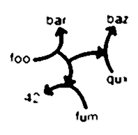

# The Entrelacs Project

The Entrelacs Project consists in prototyping the very first _Entrelacs System_ as defined by the _Entrelacs Manifesto_.



## Documentation

Visit [the project wiki](https://miellaby.github.io/entrelacs/)

## Build & Test

```sh
make tests ; # compile and tests everything (type Ctrl+D when in the shell)
make help ; # see other build commands
```

## Binary Files

| File | Description |
|------|-------------|
| `bin/libentrelacs.a` | static library for the entrelacs "core" |
| `bin/libentrelacs.so` | dynamic library |
| `bin/entrelacsd` | entrelacs HTTP server |
| `repl/bin/entrelacs` | simple REPL binary |
| `tests/testshell` | minimalist REPL |
| `web-terminal/cli.sh` | simple script to query the server (depends on curl CLI) |
| `web-terminal/fill-demo.sh` | fill up the demo server via cli.sh |

## License And Credits

* Code released under [GPLv3](http://www.gnu.org/licenses/gpl.html) license
* `sha1.c` / `sha1.h` from PolarSSL [http://www.polarssl.org/](http://www.polarssl.org/)
* `log.c` / `log.h` from MiniDLNA ( on sourceforge.net )
* HTTP server from [https://github.com/cesanta/mongoose](https://github.com/cesanta/mongoose)
* minimalist "readline" from [https://github.com/antirez/linenoise](https://github.com/antirez/linenoise)
